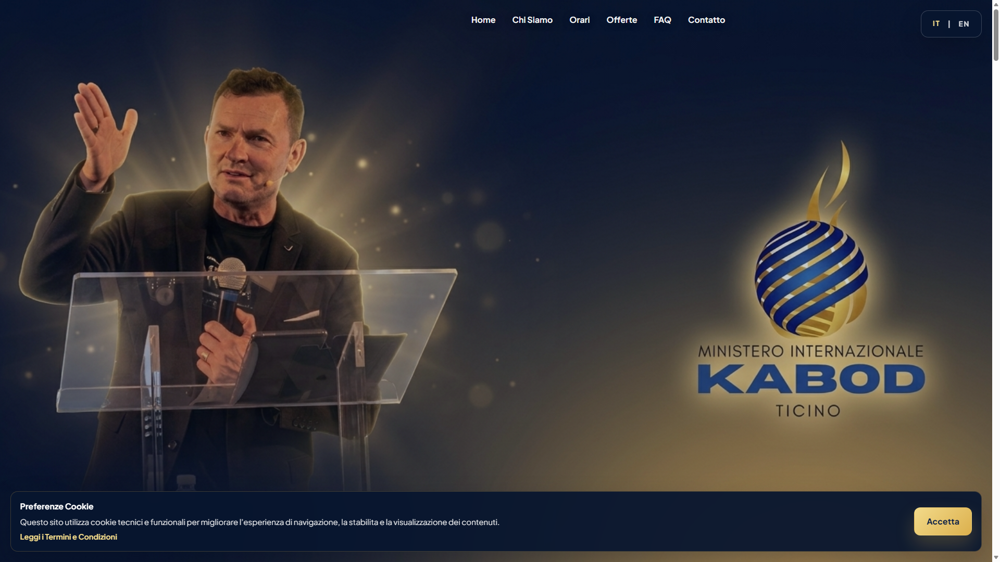
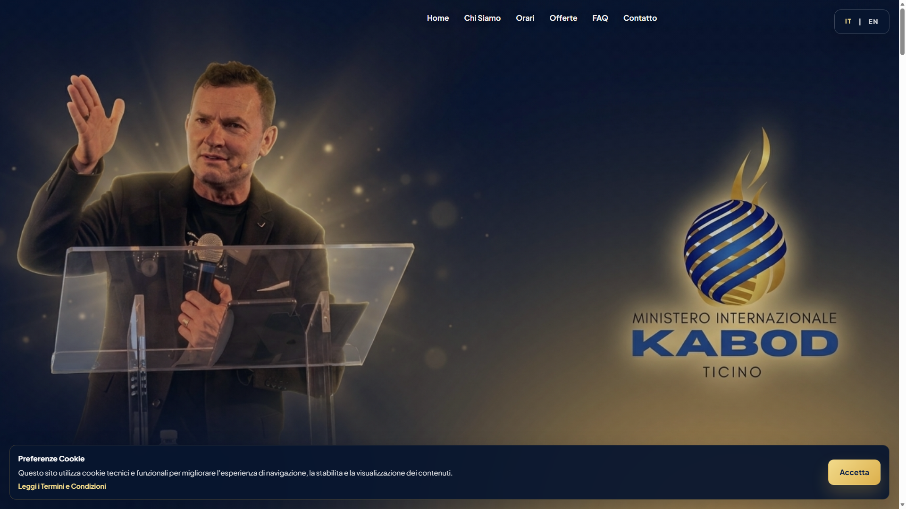

# Ministero Internazionale Kabod Ticino Landing Page

A modern bilingual landing page for Ministero Internazionale Kabod Ticino, built with React, Vite, and Bootstrap.

## Overview

This project is a responsive church/ministry landing page designed to present the ministry online with a premium visual identity, bilingual content, smooth scrolling sections, embedded media, location details, and mobile-friendly navigation.

## Screenshots

### Hero



### About Section


### Footer



## Features

- Bilingual experience: Italian and English
- Responsive layout for desktop, tablet, and mobile
- Hero section with ministry imagery
- Mobile hamburger navigation
- About, pastor, church, schedule, YouTube, giving, FAQ, contact, map, and footer sections
- Cookie consent banner
- Terms and Conditions modal
- Footer credits and social links

## Tech Stack

- React 18
- Vite 5
- Bootstrap 5
- Bootstrap Icons

## Project Structure

```text
kabod_church/
  docs/screenshots/     Project screenshots used in the README
  img/                 Static image assets
  public/              SEO and crawler assets
  src/                 React source files
  index.html           App entry HTML
  package.json         Scripts and dependencies
  vite.config.js       Vite configuration
```

## Getting Started

### Prerequisites

- Node.js 18+
- npm 9+

### Install dependencies

```bash
npm install
```

### Start development server

```bash
npm run dev
```

### Build for production

```bash
npm run build
```

### Preview production build

```bash
npm run preview
```

## Content and Assets

All local images used by the landing page are stored in the `img/` directory and imported into the React app.

## SEO and Indexing

This repository includes:

- `public/robots.txt`
- `public/sitemap.xml`

Important:

Replace `https://your-domain.example` with the real production domain before deployment.

## Security

Please see `SECURITY.md` for vulnerability reporting guidance.

## License

This project is released under the MIT License. See `LICENSE` for details.